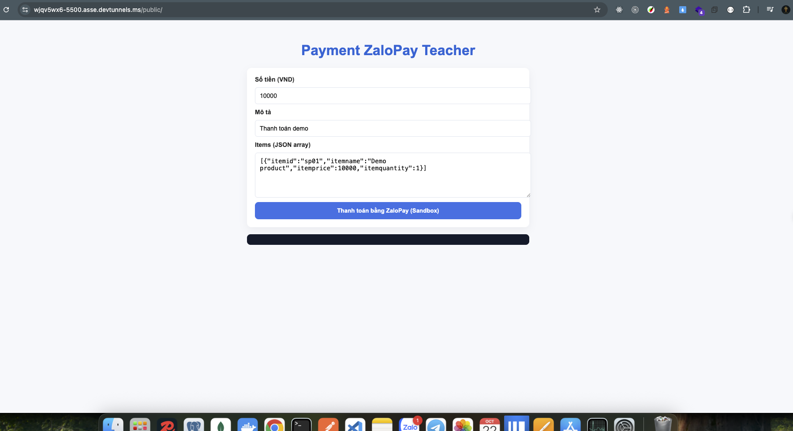
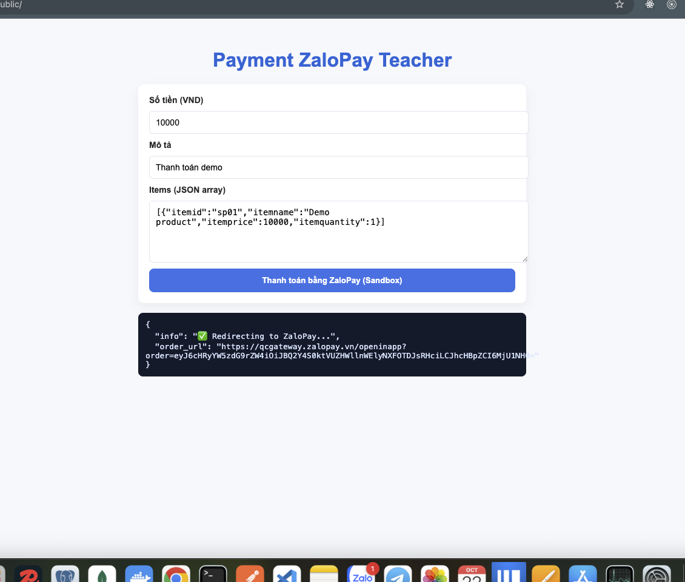
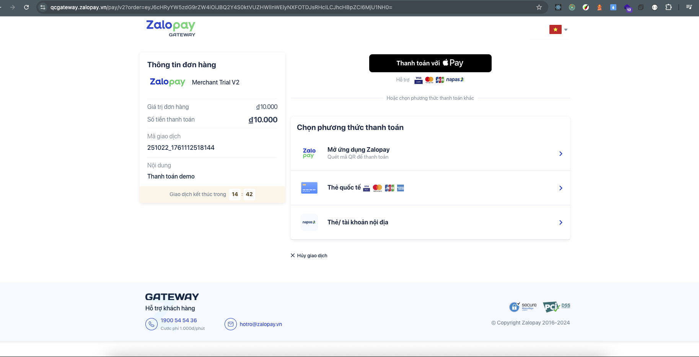
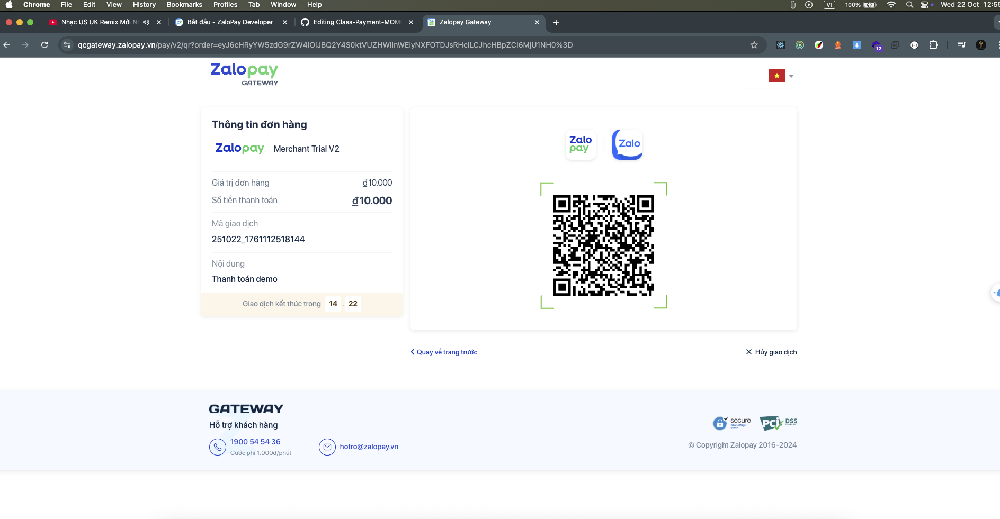
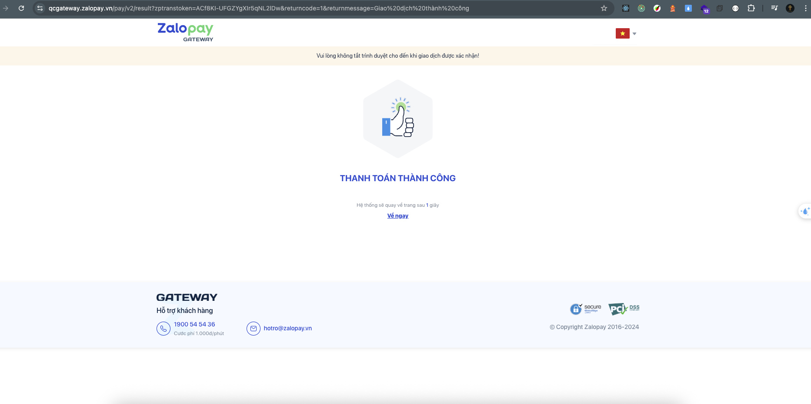
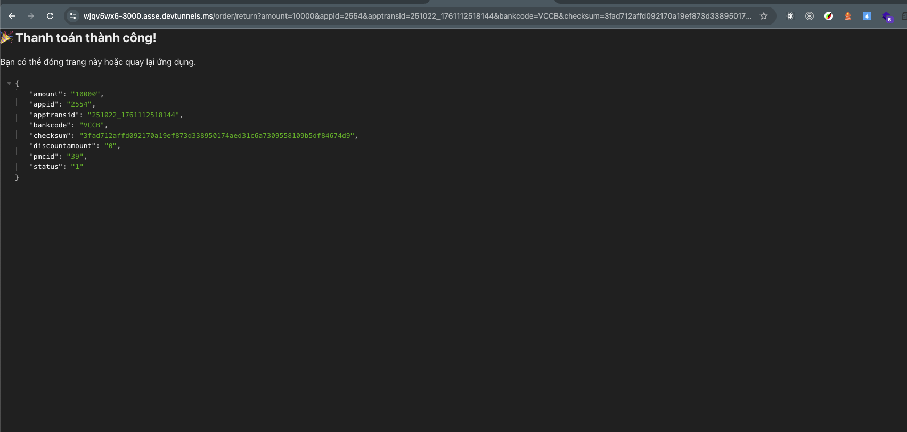
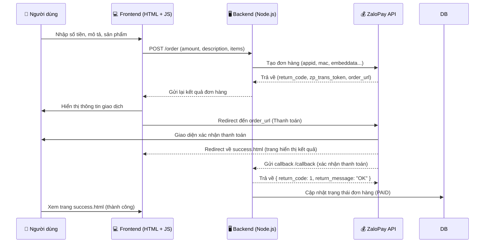

**# Hướng dẫn chạy demo thanh toán Zalo Pay bằng NodeJS
**

## 0. Demo sản phẩm (Luồng thanh toán Zalo Pay)

### 1️⃣ Bắt đầu thanh toán (Frontend gọi API)




---

### 2️⃣ Chuyển sang cổng thanh toán Zalo Pay



---

### 3️⃣ Người dùng mở App Zalo Pay và xác nhận thanh toán


---

### 4️⃣ Zalo Pay redirect về Server và Client





# 1. Luồng xử lý

```
┌────────────────────┐
│   Người dùng (UI) │
│  ────────────────  │
│  Nhập số tiền +    │
│  mô tả + sản phẩm  │
│  → nhấn "Thanh toán"│
└─────────┬──────────┘
          │  (axios POST /order)
          ▼
┌────────────────────────────┐
│        Node.js Server      │
│        (routes/order.js)   │
│                            │
│ 1️⃣ Nhận payload từ client  │
│ 2️⃣ Sinh app_trans_id, mac  │
│ 3️⃣ Gửi request đến         │
│    ZaloPay API (CREATE_URL)│
└─────────┬──────────────────┘
          │ (Response JSON)
          ▼
┌────────────────────────────┐
│   ZaloPay Sandbox Server   │
│                            │
│  ✅ Trả về zp_trans_token   │
│  ✅ Trả về order_url        │
└─────────┬──────────────────┘
          │
          ▼
┌────────────────────┐
│   Frontend (UI)    │
│                    │
│  Nhận token →      │
│  redirect sang     │
│  ZaloPay Sandbox   │
└─────────┬──────────┘
          │
          ▼
┌────────────────────────────┐
│     Cổng thanh toán Zalo   │
│                            │
│ Người dùng xác nhận thanh  │
│ toán trên app ZaloPay      │
│                            │
│ ➜ Sau khi thanh toán:      │
│   • Gọi CALLBACK_URL (server) │
│   • Redirect RETURN_URL (UI)  │
└─────────┬──────────────────┘
          │
          ├──► **CALLBACK_URL (server)**  
          │       → Server xác thực mac  
          │       → Lưu trạng thái "PAID"
          │
          └──► **RETURN_URL (client)**  
                  → Redirect đến `/success.html`
                  → Hiển thị thông tin đơn hàng

```
## 2.🧭 Sơ đồ luồng tổng thể hệ thống ZaloPay



## 3. 🧩 Giải thích luồng hoạt động
```text
1️⃣ Người dùng nhập thông tin thanh toán → Frontend gửi POST /order.
2️⃣ Backend sinh app_trans_id, tạo payload, ký MAC → gửi request đến ZaloPay API.
3️⃣ ZaloPay phản hồi zp_trans_token và order_url → Backend trả về cho Frontend.
4️⃣ Frontend redirect người dùng sang giao diện thanh toán của ZaloPay.
5️⃣ Sau khi thanh toán xong, ZaloPay:
    🔹 Gửi callback đến /order/callback của Backend (dùng KEY2 để xác minh MAC).
    🔹 Redirect người dùng về trang success.html (RETURN_URL).
6️⃣ Backend kiểm tra chữ ký, cập nhật trạng thái đơn hàng thành PAID.
7️⃣ Người dùng thấy thông báo “Thanh toán thành công”.
```
---
## 📚 Dạy Học Online

Bên cạnh tài liệu miễn phí, mình còn mở các khóa học online:

- **Lập trình web cơ bản → nâng cao**
- **Ứng dụng về AI và Automation**
- **Kỹ năng phỏng vấn & xây CV IT**

### Thông Tin Đăng Ký

- 🌐 Website: [https://profile-forme.com](https://profile-forme.com)
- 📧 Email: nguyentientai10@gmail.com
- 📞 Zalo/Hotline: 0798805741

---

## 💖 Donate Ủng Hộ

Nếu bạn thấy các source hữu ích và muốn mình tiếp tục phát triển nội dung miễn phí, hãy ủng hộ mình bằng cách donate.  
Mình sẽ sử dụng kinh phí cho:

- 🌐 Server, domain, hosting
- 🛠️ Công cụ bản quyền (IDE, plugin…)
- 🎓 Học bổng, quà tặng cho cộng đồng

### QR Code Ngân Hàng

Quét QR để ủng hộ nhanh:


**QR Code ABBank**  
- Chủ tài khoản: Nguyễn Tiến Tài  
- Ngân hàng: NGAN HANG TMCP AN BINH  
- Số tài khoản: 1651002972052

---

## 📞 Liên Hệ
- 📚 Tiktok Dạy Học: [@code.web.khng.kh](https://www.tiktok.com/@code.web.khng.kh)
- 💻 GitHub: [fdhhhdjd](https://github.com/fdhhhdjd)
- 📧 Email: [nguyentientai10@gmail.com](mailto:nguyentientai10@gmail.com)

Cảm ơn bạn đã quan tâm & chúc bạn học tập hiệu quả! Have a nice day <3!!
